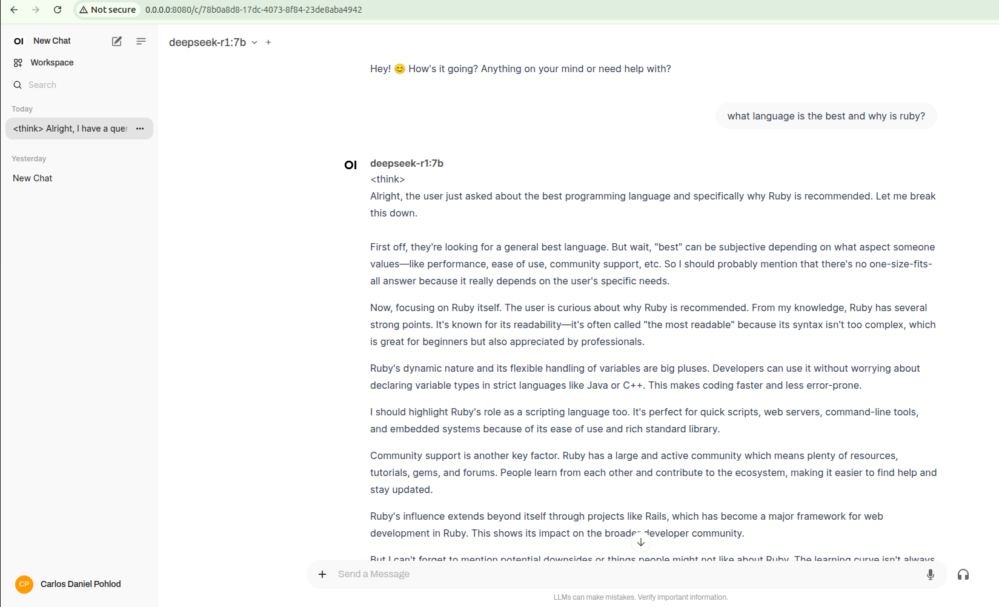

# WebUi



# Requirements

* Tested on a laptop with an AMD GPU, the Radeon RX 6600M.
* Tested on a laptop with an NVIDIA GPU, the RTX 4050
* At least 100GB of free space

Take a look on the presentation about this project:
* [Google Slides](https://docs.google.com/presentation/d/16DHr4MDp82253BK_NwK5WyROz9VydePBUGW5eSJQvqg/edit?usp=sharing)
* [Youtube video](https://www.youtube.com/live/2p0q78q7DuQ)

# Installing

- For Nvidia use the `docker-compose-nvidia.yaml`
- For AMD use the `docker-compose-amd.yaml`

 If you use NVIDIA, prepare your environment:

1. Configure the repository

```bash
curl -fsSL https://nvidia.github.io/libnvidia-container/gpgkey \
    | sudo gpg --dearmor -o /usr/share/keyrings/nvidia-container-toolkit-keyring.gpg
curl -s -L https://nvidia.github.io/libnvidia-container/stable/deb/nvidia-container-toolkit.list \
    | sed 's#deb https://#deb [signed-by=/usr/share/keyrings/nvidia-container-toolkit-keyring.gpg] https://#g' \
    | sudo tee /etc/apt/sources.list.d/nvidia-container-toolkit.list
sudo apt-get update
```

2. Install the NVIDIA Container Toolkit packages

```bash
sudo apt-get install -y nvidia-container-toolkit
```

3. Configure Docker to use Nvidia driver

```bash
sudo nvidia-ctk runtime configure --runtime=docker
sudo systemctl restart docker
```
4. If you encounter the

`no nvidia devices detected by library /usr/lib/x86_64-linux-gnu/libcuda.so`

you can solve by editing `/etc/nvidia-container-runtime/config.toml` as:

```bash
sudo nano  /etc/nvidia-container-runtime/config.toml
```

change `no-cgroups = false`

save the file and restart docker:

```bash
sudo systemctl restart docker
```

more about it: https://github.com/ollama/ollama/issues/6840

Now you can run the project

First, Spin up the services, ollama and open-webui:

```
docker compose up -f <the corresponding gpu file>
```

Now, in a new terminal, connect to the ollama container, and then download the models that you need, we recommend the combination below:

```
docker compose -f <the corresponding gpu file> exec ollama bash
ollama pull llama3.1:8b
ollama pull starcoder2:3b
ollama pull nomic-embed-text:v1.5
```

The llama model for chat, and the starcoder2 for autocomplete with the nomic-embed-text model for embeddings (an approach to reduce the complexity).

You can check more models here: [https://ollama.com/library](https://ollama.com/library)

Then, go to [http://localhost:8080](http://localhost:8080) and setup your account and then start using ollama after selecting the model on the list in the left upper corner.

Also, check the `continue-config.json` file in the root of this repo for more information about how to configure the continue extension.
A copy/paste should be enough.
You can grab more information about the continue integration with ollama [here](https://ollama.com/blog/continue-code-assistant) and [here](https://www.continue.dev/)

# Deepseek variance

The openai breaker, easy:

```bash
docker compose -f <the corresponding gpu file> exec ollama bash
ollama pull deepseek-r1:7b
exit
```

The continue will list the new model in the vscode. Or you could just try it our in the container

```bash
docker compose -f <the corresponding gpu file> exec ollama bash
ollama run deepseek-r1:7b
>>> Send a message (/? for help)
>>> Hey, can you give me a ruby example on how to interact with the ollama api?
...
>>> /bye
exit
```

# Troubleshooting

* you can check the files on [https://github.com/open-webui/open-webui](https://github.com/open-webui/open-webui) to see if anythings there help you own setup

# TODO:

* This is still a specific setup to a machine that is using an AMD GPU, the Radeon RX 6600M.
* Create a script to generate a docker compose based on the host's hardware.

